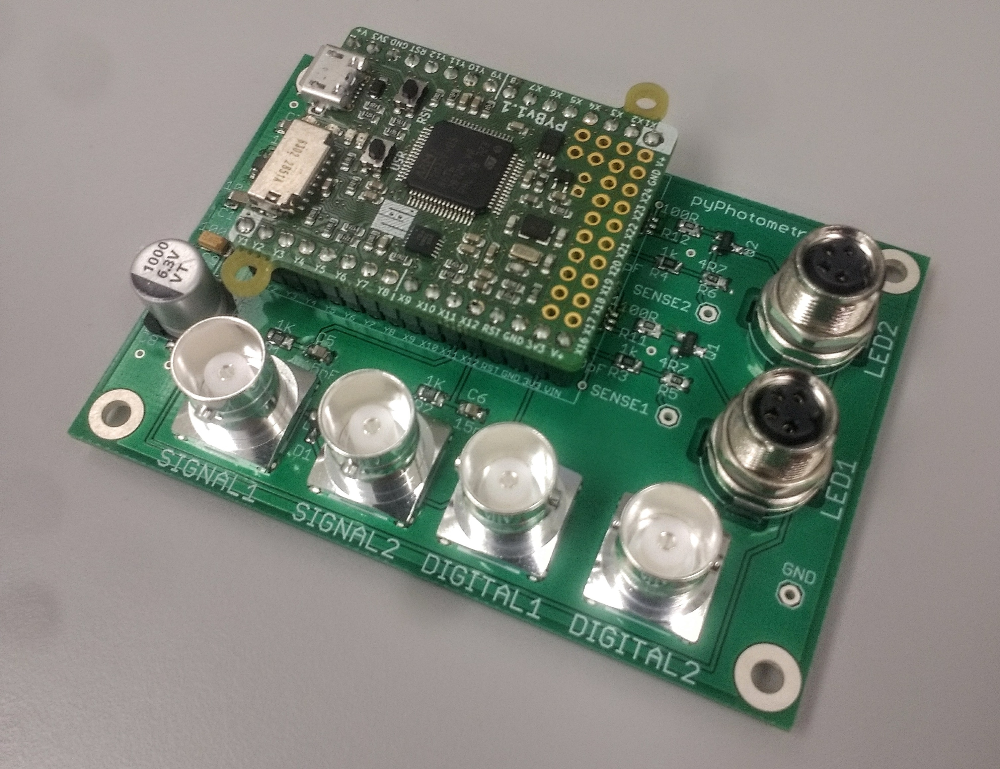

# pyPhotometry

**Open source, Python based, fiber photometry data acquisition.**

---



## Overview

pyPhotometry is system of open source hardware and software for neuroscience fiber photometry data acquisition, consisting of an [acquisition board](user-guide/hardware.md) and [graphical user interface](user-guide/graphical-user-interface.md). 

pyPhotometry supports data aquisition from two analog and two digital inputs, and control of two LEDs via built in LED drivers with an adjustable 0-100mA output.  The system supports time-division multiplexed illumination which allows fluoresence evoked by different excitation wavelengths to be independenly readout from a single photoreciever signal.  For validation experiments see the pyPhotometry [manuscript](https://www.biorxiv.org/content/early/2018/10/03/434225).

For questions about the pyPhotometry system contact the [google group](https://groups.google.com/forum/#!forum/pycontrol).

---

## Getting started

### Dependencies

pyControl has the following dependencies:

- Python 3 
- pyserial
- numpy
- pyqtgraph
- pyperclip (optional, used to copy file names to clipboard)

The simplest way to install the required dependencies is to download and install the [Anaconda](https://www.anaconda.com/download/) Python distribution, then use the *conda* package management utility to install the other packages using the following commands in the *Anaconda Prompt*:

```
conda update conda
conda install -c anaconda pyserial
conda install -c anaconda numpy
conda install -c anaconda pyqtgraph
conda install -c conda-forge pyperclip
```

pyPhotometry has been tested primarily on Windows 10 but in principle should be cross platform.  You may need to install the micropython USB drivers to ensure your operating system recognizes the board and can open a serial connection to it, see [micropython windows setup](http://micropython.org/resources/Micro-Python-Windows-setup.pdf) and the micropython [docs](http://docs.micropython.org/en/latest/pyboard/pyboard/tutorial/repl.html).  The micropython drivers are unsigned so to install them on Windows 10, follow the instructions [here](https://www.maketecheasier.com/install-unsigned-drivers-windows10/) under *Install Unsigned Drivers from Advanced Boot Menu*.  You should only need to do this the first time you install the drivers on a computer.

### Installation

Download the latest version of pyPhotometry as a zip file from the repository's [downloads](https://bitbucket.org/takam/pyPhotometry/downloads/) page.

Unzip the file and you will have the following folder structure:

```
- GUI   # Graphical user interface code.
- uPY   # Code that runs on the Micropython Microcontroller.
- tools # Tools for importing pyPhotometry data.
- data  # Default data directory.
```

### Hardware

The acquisition board can be purchased from the Open Ephys Production Site for €350 (<info@oeps.tech>) or built from components.  Assembly instructions for a red/green photometry system are provided in the [hardware user guide](user-guide/hardware.md#assembly-instructions).

### Running an experiment

Connect a pyPhotometry acquisition board to the computer with a USB cable, it will show up as both a USB serial port and a flash drive.

Copy the file *photometry_upy.py* from *pyPhotometry/uPY* to the root directory of the acquisition board flash drive.

Load the GUI by running the file *photometry_gui.py* in the folder *pyPhotometry/GUI*, you will see a GUI window like that shown above.

Select your aqusition board using the *Serial port* drop down menu and connect to the board with the connect button.

Select the data acquisition mode, for more information see the [GUI user guide](user-guide/graphical-user-interface.md#acquisition-settings).

Press *Start* to start data acquisition.

Adjust the LED currents (and photoreciever gain if applicable) to bring the signals into the center of the 0 - 3.3V range covered by the analog inputs.  Signals that exceed 3.3V it will be clipped.  If the signal is very low the signal to noise ratio will be less good.  When adjusting the LED current it is recommended to use the 'two colour continous' acquisition mode as this mode does not use baseline subtraction so the signal you see is the raw photoreciever voltage.

To record data enter a subject ID and data directory and press *Record*.

For information on opening data files generated by pyPhotometry see [Importing data](user-guide/importing-data.md).

If you encounter problems take a look at the [troubleshooting](user-guide/troubleshooting.md) page or contact the [google group](https://groups.google.com/forum/#!forum/pycontrol).