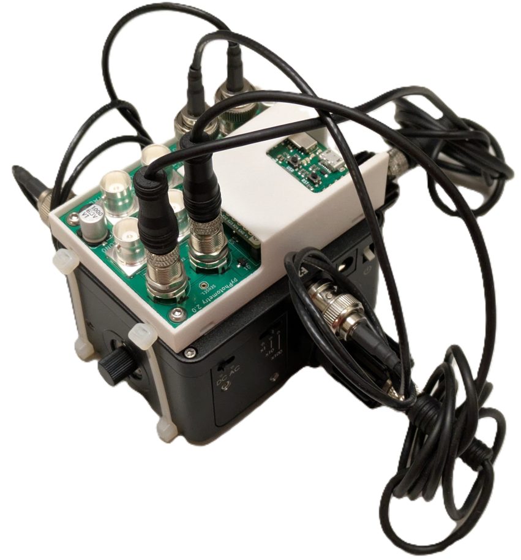
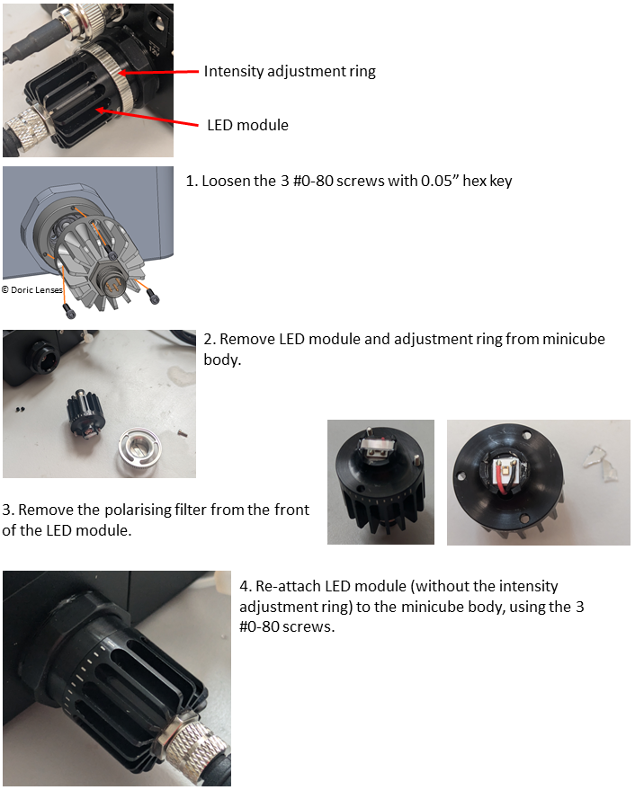
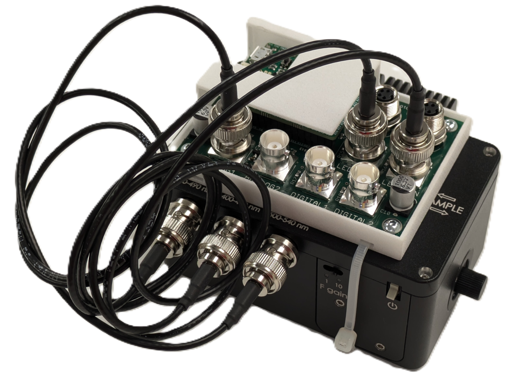
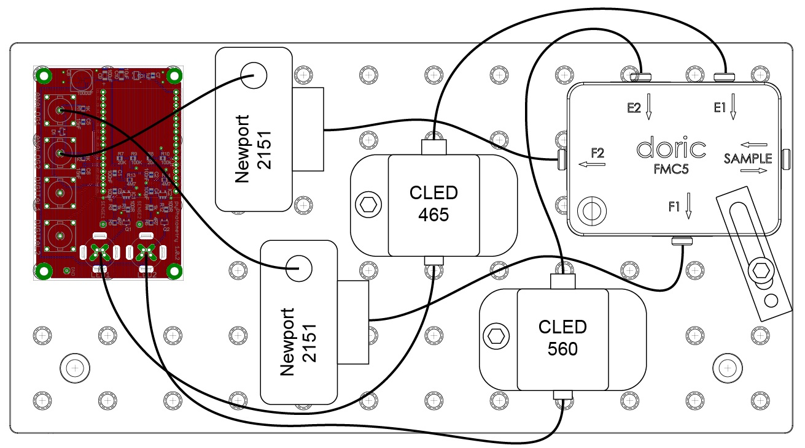

# Optical components

To make a complete photometetry system the acquisition board needs to be paired with LEDs, photorecievers, and optical components.  The optical setup detailed in the original manuscript used a Doric minicube with seperate LEDs and photodetectors connected through optic fibers.  Since the  manuscript was published Doric have introduced minicubes with integrated LEDs and Photodetectors which we recommend for new setups.  We provide parts lists below for both the original system detailed in the manuscript, and a system using a Gen 2 Doric minicube with integrated LEDs and photodetectors.

!!! warning "Compatibility"

    If you plan to use different optical components from those listed below please check the following features of the hardware to ensure compatibility:
    
    - **Output voltage:**  The pyPhotometry board analog inputs can read voltages from 0 to 3.3V, so will not work with photorecievers with AC coupled outputs which generate signals that go below 0V.
    
    - **Signal bandwidth:**  The pulsed illumination modes of the pyPhotometry system require a signal bandwidth of at least 0-750Hz to work correctly. Photorecievers with a smaller signal bandwidth will cause the signals to respond to changes in light intensity too slowly to work with the pulsed illumination modes.
    
    - **LEDs:**  The LED driver outputs on the pyPhotometry board are constant current LED drivers that should be connected directly to LEDs, not to the control input of an LED driver.  The v2.0 acqusisition board has additional LED control outputs that output an analog voltage signal (0-3.3V) that can be used with optical hardware that has integrated LED drivers.

## Doric Minicube optical setups

### Generation 2 minicubes

The pyPhotometry v1.0 board is compatible with Doric Gen 2 minicubes with integrated LEDs and photodetectors, but not with Doric Gen 3 minicubes that also integrate the LED drivers.

By default, Doric Gen 2 minicubes are supplied with an intensity adjustment ring on some LEDs, which uses crossed polarisers to allow for manual adjustment of the light intensity.  This dramatically reduces the light delivered to the sample, due to both the polarising filters and increased distance from LED to input port, which is not desirable for use with pyPhotometry.  When ordering Gen 2 minicubes, request Doric supply them without the LED intensity adjustment ring.  If you already have a Gen 2 minicube that has the intensity adjustment ring fitted, you can remove it by following the instructions below, giving an ~6x increase in light intensity at the sample.

#### Parts list for Red / Green system.

The table below details the parts needed for a red/green two colour photometry system based on a Doric Gen 2 minicube.  The minicube comes with the BNC and M8 cables needed to connect it to the pyPhotometry board.

| Description                                                  | Supplier | supplier part number                                        | Quantity |
| ------------------------------------------------------------ | -------- | ----------------------------------------------------------- | -------- |
| Generation 2 Doric Mini-cube with integrated LEDs and photodetectors. | Doric    | ilFMC5-G2_E1(460-490)_F1(500-540)_E2(555-570)_F2(580-680)_S | 1        |
| Pigtailed fiber optic rotary joint (optional)                | Doric    | FRJ_1x1_PT-G2_200-0.57_1m_FCM_0.15m_FCM                     | 1        |
| Rotary joint holder (if rotary join used)                    | Doric    | Holder_FRJ_Small                                            | 1        |
| FC_FC adapter (if rotary join used)                          | Doric    | ADAPTER_FC                                                  | 1        |
| Fiber patch cord 1m                                          | Doric    | MFP_200/230/900-0.57_1m_FC-MF1.25(F)_LAF                    | 1        |
| pyPhotometry board                                           | OEPS     | pyPhotometry                                                | 1        |

RWD are also a good option for low cost [fiber patch cords](https://www.rwdstco.com/product-item/optical-fiber/) and [fiber cannulae](https://www.rwdstco.com/product-item/fiber-optic-cannulae-with-ceramic-ferrule/). 

#### LED intensity adjustment ring removal.

The modification is straighforward but will void the warranty on the LED module.

 

### Generation 3 minicubes

The v2.0 pyPhotometry board can be used with Doric Gen 3 minicubes which have integrated LED drivers, by using the LED control outputs which output an analog control voltage, rather than the LED driver outputs.  The Doric Gen 3 minicubes are supplied with neutral density filters on some of the LEDs which reduce the LED power by a factor of 10.  This is typically not desirable for use with pyPhotometry, as the pulsed acquisition modes require higher LED-on power than systems which keep the LEDs on continuously during acquisition.  The neutral density filters are located in user-accessible trays on the bottom of the minicube and can straightforwardly be removed and replaced as needed.

## Original optical setup.

The table below lists the set of components for the red/green two colour photometry system reported in the original pyPhotometry manuscript, based on a Doric minicube with seperate LEDs and photorecievers.

| Name                                                 | Quantity | Part                                                   | Supplier |
| ---------------------------------------------------- | -------- | ------------------------------------------------------ | -------- |
| Photoreciever                                        | 2        | Newport 2151 with lensed FC adapter                    | Doric    |
| 465nm   LED                                          | 1        | CLED_465                                               | Doric    |
| 560nm   LED                                          | 1        | CLED_560                                               | Doric    |
| Minicube                                             | 1        | FMC5_E1(450-490)_F1(500-540)_E2(550-580)_F2(600-680)_S | Doric    |
| Fiber patchcord:  LED - Minicube                     | 2        | MFP_200/220/LWMJ-0.48_0.3m_FCM-FCM                     | Doric    |
| Fiber patchcord:  Minicube - Photoreciever           | 2        | MFP_600/630/LWMJ-0.48_0.3m_FCM-FCM                     | Doric    |
| Fiber   patchcord: Rotary-sample                     | 1        | MFP_200/220/900-0.48_1m_FCM-MF1.25                     | Doric    |
| Pigtailed   rotary joint                             | 1        | FRJ_1x1_PT_200/230/LWMJ-0.48_1m_FCM_0.2m_FCM           | Doric    |
| FC-FC adapter                                        | 1        | ADAPTER_FC style 2                                     | Doric    |
| Optical breadboard 150x300mm metric                  | 1        | MB1530F/M                                              | Thorlabs |
| M6 - M3   thread adapter                             | 4        | MSA6/M                                                 | Thorlabs |
| Clamp   for minicube                                 | 1        | CL3/M                                                  | Thorlabs |
| Clamp for photodetector                              | 2        | MSC2 Clamping Fork for 1/4"-20 (M6) Cap Screw          | Thorlabs |
| Pillar   for photodetector                           | 2        | TRP14/M Ø12 mm Pedestal Pillar   Post                  | Thorlabs |
| M6 screw   12mm                                      | 4        | SH6MS12                                                | Thorlabs |
| USB A -   micro B cable 1.8m                         | 1        | 121-3251                                               | RS       |
| BNC   cable 0.3m: Photoreciever to acquisition board | 2        | 886-0706                                               | RS       |
| M3 screw   10mm                                      | 4        | 660-4636                                               | RS       |
| M3   spacer 3mm                                      | 4        | 161-3676                                               | RS       |
| M6 x   45mm                                          | 2        | 468-0133                                               | RS       |

### Assembly instructions.

The optical components are positioned and connected as indicated below:

Attach the minicube to the optical breadboard using the clamp (CL3/M) and 45mm M6 bolts.
    
Attach the acquisition board to the breadboard using the M6-M3 screw adaptors, M3 spacers and 10mm M3 screws.  Screw the adaptors into the breadboard, then attach the acquisition board with the spacers between the board and the adaptors.

Attach the Newport photorecievers to the breadboard using the pillars (TRP14/M), clamping forks (MSC2) and 12mm M6 bolts.

Attach the LEDs to the breadboard using the 12mm M6 bolts.

Connect the photorecievers to the minicube using the 30cm, 600um core 0.48NA optic fibers  (MFP_600/630/LWMJ-0.48_0.3m_FCM-FCM)

Connect the LEDs to the minicube using the 30cm, 200um core 0.48NA optic fibers (MFP_200/220/LWMJ-0.48_0.3m_FCM-FCM)

Connect the photorecivers to the acquisition board analog inputs using the 30cm BNC cables.

Connect the LEDs to the acquisition board LED outputs using their built in cables.  It is not necessary to connect the power supplies for the LED cooling fans as the maximum current output by the acquisition board is only 10% of the LEDs rated current.

Connect the pigtailed rotary joint to the sample port of the minicube and connect the fiber patchcord to the rotary joint using the FC-FC adapter.