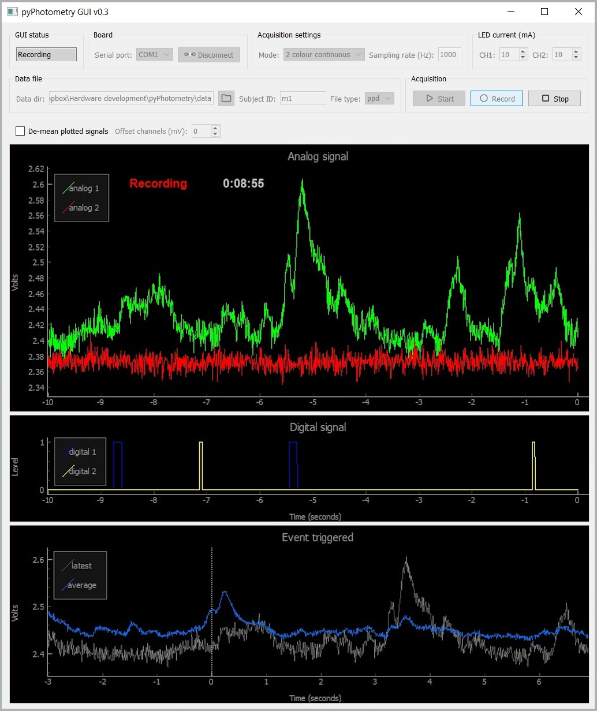

# pyPhotometry GUI



The pyPhotometry GUI provides a graphical interface for controlling data acquisition and visualising signals.  The GUI is split into a control panel at the top and a set of plots underneath.

# Control panel

The controls are grouped into boxes with the following fuctions:

---

### GUI status

Indicates the current state of the GUI / acquisition board.

---

### Board

Select an aquisition board from the dropdown menu and connect/disconect to the selected board with the button.

---

### Acquisition settings

Select aquisition mode from the dropdown menu and specify the sampling rate for data aquisition.  The available acquisition modes are:

`2 color continuous` Signals are aquired from two photorecievers (analog inputs 1 and 2) with both LEDs on continuously during aquisition.

`2 colour time div.` Signals are aquired from two photorecievers (analog inputs 1 and 2) using time division illumination and baseline subtraction. The acqusition sequence is:

```
1. Turn LEDs 1 and 2 off. Read analog 1 baseline.

2. Turn LED 1 on. Read analog 1 sample, subtract baseline, return as signal 1.

3. Turn LEDs 1 and 2 off. Read analog 2 baseline.
  
4. Turn LED 2 on. Read analog 2 sample, subtract baseline, return as signal 2.
```

Time division illumination means that crosstalk between the two signals is determined by both the absorbtion and emission spectra of the two flurophores, rather than just by the emission spectra as with continuous illumination.  For flurophores where the emission spectra overlap significantly (e.g. GCaMP with TdTomato or RCaMP) this can very substantially reduce crosstalk. 

Baseline subtraction makes the signals insensitive to bleed-through of ambient light, and reduces the influence of low frequency noise sources similarly to lock in amplification.  

Due to these advantages this aquisition mode is recommended over continuous illumination for two colour measurements.  For more information about time division illumination see the pyPhotometry [manuscript](https://www.biorxiv.org/content/early/2018/10/03/434225).

Baseline subtraction changes the appearence of high frequency noise, as noise present when the baseline sample is read is subtracted from noise when the signal sample is read.  If you need to de-noise a setup (high gain amplifiers in photoreceivers can pick up electrical noise from nearby equipment) it is  recomended to use *2 colour continuous* mode to get a clear picture of the noise.

`1 colour time div.` Uses the same acquistion sequence as `1 colour time div.` except that signal 1 and signal 2 both read analog input 1 (i.e. a single photoreciever).  The typical use case is alternating illumination of GCaMP with 470nm and 405nm LEDs to provide a calcium sensitive and a calcium insensitive (isosbestic) signal for use as a movement control. 

The maximum sampling rate is 1 KHz for the continous illumination mode and 130 Hz for the time division illumination modes.

---

### LED current

Adjust the current for LEDs 1 and 2 over a range of 0 - 100mA.

---

### Data file

Specify the directory where data files will be saved, the subject ID, and the data file type.  File names are determined by the subject ID, date and time the recording started, and file type, e.g. `m1-2018-08-30-103945.ppd`.  The file type can be either 'ppd' for a binary data file, or 'csv' for a comma seperated value data file. For more information about file types see [importing data](../user-guide/importing-data.md).
 
---

### Acquisition

The *Start* button starts data aquisition.  The *Record* button starts recording data to disk, it is greyed out unless a subject ID and a valid data directory are specified.  When recording is started the file name is copied to the clipboard. The *Stop* button stops data aquisition. 

# Default settings

The acquisition mode, LED currents and file type that are selected by default when the GUI is opened can be specified by editing the file *pyPhotometry/GUI/config.py*. 

# Plots

The plot panels display data during acquisition.  The plots can be resized by dragging the dividers between them.  Right clicking on plots brings up a context menu that allows the axis ranges to be set manually or to autoscale.

---

### Analog signal

Scrolling plot displaying the analog signals.  Ticking the checkbox *'De-mean plotted signals'* subtracts the average value from each signal before plotting, making it easier to visualise both signals when they have different baseline levels (this does not affect the data saved).  You can then use the 'Offset channels' control to adjust the relative Y position of the de-meaned signals.

---

### Digital signal

Scrolling plot displaying the digital signals.

---

### Event triggered

An event triggered average of analog signal 1 triggered on rising edges of digital signal 1. The average is recency weighted using an exponential decay with time constant 5 events.