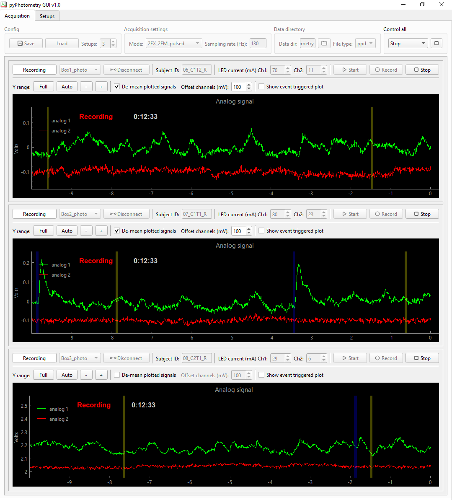
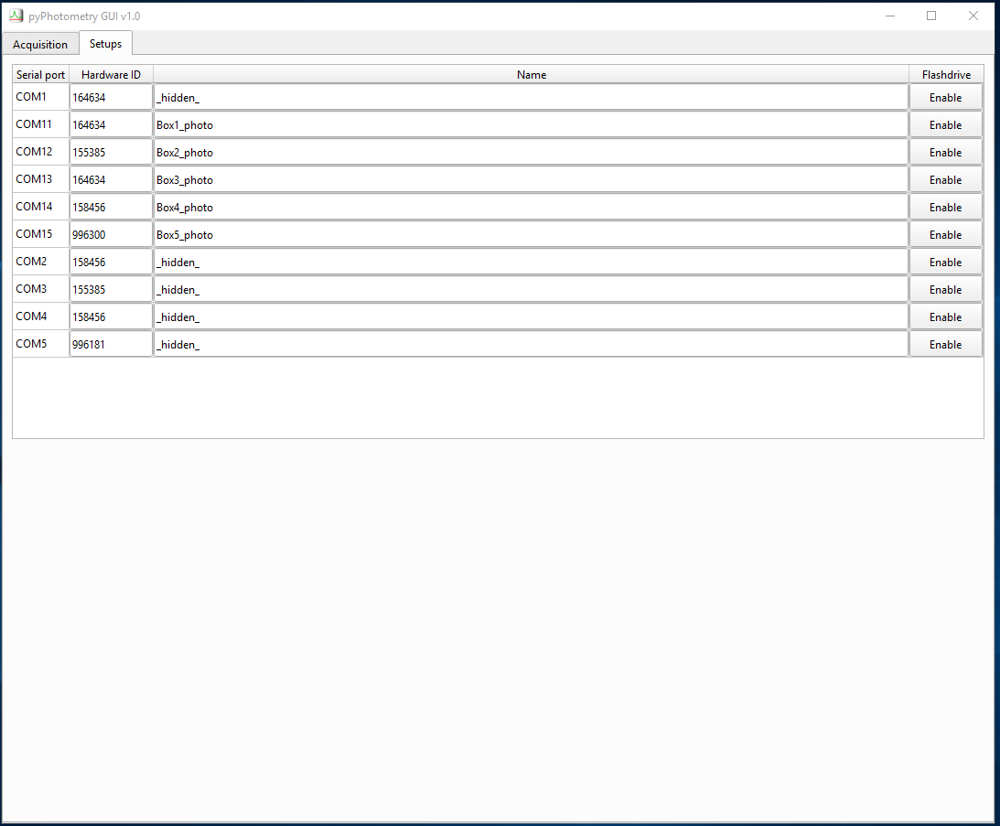

# pyPhotometry GUI

The pyPhotometry GUI provides a graphical interface for controlling data acquisition and visualising signals.  The GUI has two tabs, *Acquisition* and *Setups*.

## Acquisition tab



The acquisition tab provides functionality for acquiring and visualising data from one or more pyPhotometry systems.  The controls at the top of the tab set parameters for all setups, while each setup has its own controls above the corresponding plot panel.

### Config

The config control box is used to specify the number of setups, and to load and save GUI configurations. When you save a configuration, the current state of the acquisition tab is saved as a json file, in the *experiments* folder by default.  This includes the subject IDs and LED currents specified for each setup, as well as the acquisition mode, sampling rate and data directory. 

### Acquisition settings

The *mode* dropdown menu is used to select the acquisition mode.  Acquisition modes were renamed in pyPhotometry v1.0 as the original names, e.g. `1 colour time division` referred only to the number of emission wavelengths, not excitation wavelengths, which would have caused ambiguity with the addition of a new acquisition modes.  The acquisition mode names specify the number of excitation wavelengths (i.e. LEDs) and emission wavelengths (i.e. photoreceivers) used, and whether the LEDs are on continuously or pulsed for time-division multiplexed illumination, so e.g. the `2EX_2EM_pulsed` mode uses two LEDs, two photoreceivers, and pulsed illumination.

The correspondence between the new and old names is:

| Version >= 1.0 mode name | Version < 1.0 mode name |
| ------------------------------------ | ----------------------------------- |
| `2EX_2EM_continuous`                 | `2 colour continuous`               |
| `2EX_2EM_pulsed`                     | `2 colour time division`            |
| `2EX_1EM_pulsed`                     | `1 colour time division`            |
| `2EX_3EM_pulsed`                     | Not implemented                     |

#### Acquisition modes 

`2EX_2EM_continuous` Signals are acquired from two photorecievers (analog inputs 1 and 2) with both LEDs on continuously during aquisition.  This mode is useful for troubleshooting as the plotted signals are the raw photoreceiver voltages without baseline subtraction (see below), but is not recommended for acquiring data.

`2EX_2EM_pulsed` Signals are acquired from two photoreceivers (analog inputs 1 and 2) using time division illumination and baseline subtraction. The acqusition sequence is:

```
1. Turn LEDs 1 and 2 off. Read analog 1 baseline.

2. Turn LED 1 on. Read analog 1 sample, subtract baseline, return as signal 1.

3. Turn LEDs 1 and 2 off. Read analog 2 baseline.
  
4. Turn LED 2 on. Read analog 2 sample, subtract baseline, return as signal 2.
```

Time division illumination minimises crosstalk between signals as both the absorption and emission spectra of the fluorophores contribute to signal separation.  For example, when recording dLight signals with a TdTomato control channel using continuous illumination, the overlap between dLight and TdTomato emission wavelengths is sufficient to contaminate the TdTomato channel with dLight signal.  When using time-division illumination the blue LED is off when the TdTomato signal is meausured so the dLight is not excited and there is minimal crosstalk.

Baseline subtraction makes the signals insensitive to bleed-through of ambient light, and reduces the influence of low frequency noise sources similarly to lock in amplification.  

Due to these advantages pulsed illumination is recommended over continuous illumination for recording signals.  For more information see the pyPhotometry [manuscript](https://rdcu.be/bpvvJ).

Baseline subtraction changes the appearance of high frequency noise, as noise present when the baseline sample is read is subtracted from noise when the signal sample is read.  If you need to de-noise a setup (high gain amplifiers in photoreceivers can pick up electrical noise from nearby equipment) it is  recomended to use *2EX_2EM_continuous* mode to get a clear picture of the noise.

`2EX_1EM_pulsed` mode uses the same acquisition sequence as `2EX_2EM_pulsed` except that signal 1 and signal 2 both read analog input 1 (i.e. a single photoreceiver).  A typical use case is alternating illumination of GCaMP with 470nm and 405nm LEDs to provide a calcium sensitive and a calcium insensitive (isosbestic) signal for use as a movement control. 

`3EX_2EM_pulsed` mode uses 3 LEDs and two photorecievers, and is designed for e.g. red/green/isosbestic recordings.  As there are only 2 LED drivers on the pyPhotometry board an additional external LED driver must be used, with its trigger input connected to digital 2 on the pyPhotometry board, which is configured as an output in this acquisition mode. Signal 1 is acquired from analog 1 with LED 1 on, signal 2 is acquired from analog 2 with LED 2 on, and signal 3 is acquired from analog 1 with LED 3 (external LED driver) on.  A typical use case would be to use signal 1 for GCaMP, signal 2 for RdLight, and signal 3 for an isosbestic control channel.

#### Sampling rate

The sampling rate control specifies the rate at which samples are acquired for each channel.  The maximum sampling rate is 1 KHz for the continuous illumination mode and 130 Hz for the two LED pulsed illumination modes, and 76 Hz for the 3 LED pulsed mode.

#### Sync-out

When the sync-out checkbox is checked, the Digital 1 BNC connector is configured as an output, and used to output sync-pulses to synchronise pyPhotometry data with other hardware systems.  The sync pulses have random inter-pulse intervals, as this ensures that it is always possible to identify which sync pulses correspond to which on different systems even if some sync pulses are missing (e.g. because one system was started part way through a session).  See the [pyControl synchronisation docs](https://pycontrol.readthedocs.io/en/latest/user-guide/synchronisation/) for more information on using such sync pulses to align data.  The default pulse width is 100ms an inter-pulse intervals are uniformly distributed between 1 and 5 seconds, but this can be changed by editing the file `config\sync_out_config.json`.  The sync pulse output is recorded as the `digital_1` signal in the pyPhotometry data files.

### Data directory

Specifies the directory where data files will be saved and the data file type.  The file type can be either 'ppd' for a binary data file, or 'csv' for a comma seperated value data file. For more information about file types see [importing data](../user-guide/importing-data.md). Data file names are determined by the subject ID, date and time the recording started, and file type, e.g. `m1-2018-08-30-103945.ppd`.

### Control all

The *Control all* box is used to control multiple setups simultaneously, using buttons for *Connect*, *Start*, *Stop*, *Record* indicated by the corresponding icons.  The box is only active when all setups are in the same state.

### Individual setup controls

Each  setup has a set of controls that apply only to that setup, located above its plot panel. The top row of controls from left to right are:

- Dropdown menu to select which setup to connect to.

- Connect/disconnect button to connect to the selected setup.

- Text box to specify the subject ID.

- LED current controls for channels 1 and 2.

- Buttons to start data acquisition, record data to disk, and stop acquisition.

The second row are plotting controls:

- Set the plot's Y range to the *Full* 0 to 3.3 Volt range, *Auto*-scale the range to the current data, or specify the Y limits.
- Tick the *De-mean plotted signals* checkbox to subtract the average value from each signal before plotting, making it easier to visualise both signals when they have different baseline levels (this does not affect the saved data).  You can use the *Offset channels* control to adjust the relative Y position of the de-meaned signals.
- Tick the *Lowpass filter* checkbox to apply a 10Hz lowpass filter to the plotted signals (this does not affect the saved data).
- The *Show event triggered plot* checkbox controls whether the event triggered plot is shown.  By default it is shown when using a single setup but hidden when using more than one setup to save screen space.

### Keyboard shortcuts

`Ctrl+A` Autoscale all plots Y range to the current data.

`Ctrl+F` Set all plots to the full 0-3.3V Y range.

`Ctrl+D` Toggle *'De-mean plotted signals'* for all plots.

### Plots

Each setup has its own plot panel. The main plot shows scrolling analog signals, with digital pulses marked as shaded areas.  

The event triggered plot shows an event triggered average of signal 1, triggered on rising edges of digital 1. The average is recency weighted using an exponential decay with time constant 5 events.

### Default settings

The acquisition mode, LED currents and file type that are selected by default when the GUI is opened can be specified by editing the file *pyPhotometry/config/GUI_config.py*.  You can also specify which acquisition modes are available for selection in the drop-down menu, and how often plots are updated during acquisition.  Increasing the `update_interval` may be necessary if the GUI freezes when recording from many setups simultaneously.

## Setups tab



The setups tab is used to name and configure setups. A setup's name determines how it appears in board select drop-down menus on the acquisition tab.  If no name is specified, the serial port is used to identify the setup in the board select menu. If you have pyboards connected to the computer that are not pyPhotometry setups, e.g. [pyControl](https://pycontrol.readthedocs.io) behavioural setups, you can prevent them from appearing in the board select drop down menu by naming them `_hidden_`.  

The *Device type* dropdown menu is used to specify the type of acquisition board.  By default  `pyPhotometry_v1.0` and `pyPhotometry_v2.0` boards are supported, but if you are using a customised acquisition board you can create a corresponding hardware config json file in *config/devices*.

By default pyboards appear as a USB flash drive on the computer filesystem.  You can disable this using the *Flashdrive* enable/disable button by each setup.  This does not affect the boards use by pyPhotometry, but can be useful to avoid having lots of flash drives showing on the computer.