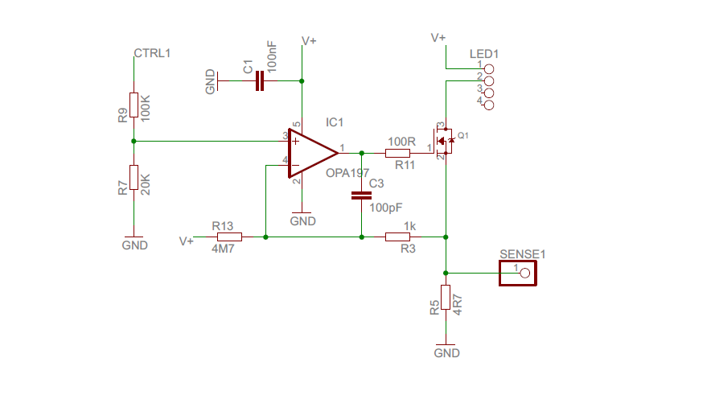
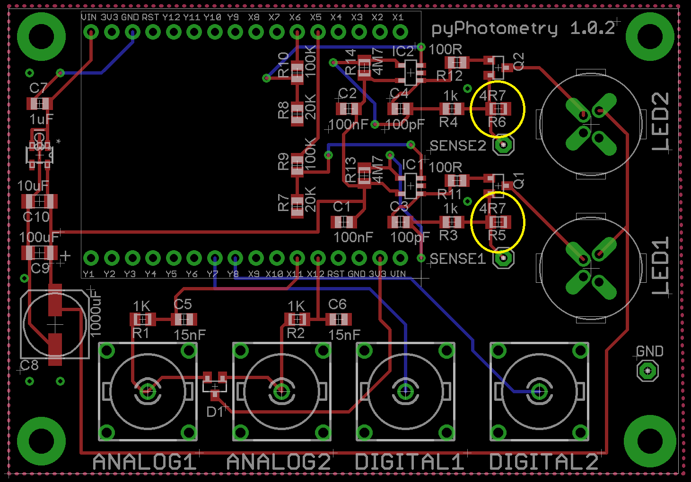

# Acquisition board

The pyPhotometry acquisition board uses a [Micropython](https://micropython.org/) microcontroller to acquire two digital and two analog signals, and to generate analog control signals for two built in LED driver circuits.  The acquisition board draws power from the Micropython's USB connector and requires no additional power supply.

!!! warning "Safety"

    To prevent short circuits due to contact with metal objects, the board should be securely mounted using M3 bolts and insulating spacers.  The mounting holes on the acquisition board have a 50 x 75mm spacing so the board can be mounted directly on a Thorlabs metric optical breadboard using M6 to M3 thread adaptors.

    Though the LED drivers are relatively low power, care should be taken to avoid shining light directly into the eye.  This is particularly important with LEDs whose wavelength lies outside the visible spectrum.

### Analog inputs

The two BNC analog inputs `SIGNAL 1` and `SIGNAL 2` receive fluorescence signals as analog voltages from the photodetectors.  The signals pass through an RC lowpass filter with a cuttoff frequency of 10KHz and then are read by the Micropython board's analog to digital converters (ADCs).  The Micropython ADCs have a 0 - 3.3V input range.  As the ADC pins are not 5V tolerant, clamp diodes to the 3.3V rail are used to prevent damage if the signal rises above 3.3V. [Oversampling](https://www.silabs.com/documents/public/application-notes/an118.pdf) is used to increace the 12-bit resolution of the ADCs to 15 bits - i.e. to generate each sample the ADC is read 64 times and averaged, giving an extra 3 bits of resolution.  

### Digital inputs

The two BNC digital inputs are compatible with 5V or 3.3V logic and are typically used to acquire sync pulses or timestamps, e.g. generated by behavioural hardware.  The digital inputs connect directly to pins on the microcontroller.

### LED drivers

The aquisition board has two constant current LED driver circuits which are controlled by the Micropython's digtal to analog converters (DACs), allowing the LED current to be adjusted between 0 - 100mA.  The LED driver outputs are M8 connectors that are compatible with either [Doric](http://doriclenses.com/life-sciences/led-modules/783-connectorized-led.html) or [Thor Labs](https://www.thorlabs.com/newgrouppage9.cfm?objectgroup_id=5206) connectorized LEDs.  

The LED driver circuits are voltage controlled current sinks in which an op amp adjusts the voltage at an MOSFET's gate to bring the voltage across a sense resistor in series with the LED into agreement with the control voltage from the microcontroller.  A resistor between the 3.3V rail and the inverting input of the op amp ensures the MOSFET is fully turned off when the control voltage is 0.  The LED current can be monitored by measuring the voltage between the *SENSE1* or *SENSE2* and *GND* connections on the acquisition board, which gives the voltage across the 4.7 ohm sense resistors in series with the respective LEDs.

## Assembly instructions

**Acquisition board**

The acquisition board can be purchased from the [Open Ephys store](http://www.open-ephys.org/pycontrol) for €364 or built from components.  The design files for the acquisition board are in the [hardware repository](https://github.com/pyPhotometry/hardware). To assemble the board from components you will need to get the PCB printed (using either the Gerber or Eagle files) and order the electronic components listed in the BOM (Farnell part numbers are provided).

Assembling the acquisition board requires both surface mount and through hole soldering.  The surface mount soldering can be done either using a reflow oven or hand soldering.  Hand soldering of surface mount components requires a bit of practice but there are lots of [tutorials](https://www.google.co.uk/search?q=surface+mount+soldering+tutorial) online.  Solder all the surface mount components before soldering the through hole components as once the through hole components are in place they will get in the way.  The micropython board is attached to the acqusition board using the male and female 16 way headers.  First solder the female headers onto the micropython board, then insert the male headers into the female headers, mount the micropython on the acquisition board and solder the male headers.

**Optical components**

To make a complete photometetry system the acquisition board needs to be paired with LEDs, photorecievers, and optical components, see the [Optical Components](../resources/optical-components.md) docs for information about compatible optical components and parts lists for Red/Green photometry systems based on Doric Minicubes.

## Modifying the pyPhotometry board for higher LED current

The LED drivers on the standard pyPhotometry board can output up to 100mA currents.  While this is fine for many applications, higher LED currently may be preferable in some cases - e.g. with constructs that need higher light intensities or use wavelengths where only less efficient LEDs are available.  

We plan to release a version of the board with higher maximum LED current, but have also looked into the possibility of increasing the maximum LED current that can be output from the standard board.  With a simple modification to the board - changing one resistor value per LED driver, it is possible to increase the maximum current that can be used in the time-division illumination modes up to 400mA.  **Modifiying the board risks damaging it and is done entierly at users risk**.

The schematic of the LED driver circuit is shown below.  The current through the LED is controlled by the MOSFET (labled Q1), whose reistance is determined by the voltage applied to its gate by the opamp (IC1). The opamp adjusts the  gate voltage, and hence LED current, to bring the voltage across the sense resistor (R5) into agreement with the voltage at the + input to the opamp, which is controlled by the pyboard DAC (connected to wire CTRL1).

The upshot of this is that the LED current is proportional to the control voltage output by the pyboard DAC, with a slope determined by the value of the sense resistor R5.  If you halve the value of the sense resistor R5, the LED current for a given control voltage will be doubled.

The maximum current that can safely be output is limited by power dissipation in the MOSFET and sense resistor.  LEDs typically have a forward voltage of 1.8-3.3V depending on the LED wavelength and current.  The supply voltage is 5V, and the remaining voltage drop will occur across the MOSFET and sense resistor, dissipating power as heat.  Higher LED currents result in more power dissipation and hence more heating, putting an upper limit on the current that can be delivered without damaging these components.

This is approximagely 200mA continuous current, but will depend a bit on the exact LED used, so limiting max currents to 100mA is recomended in continous mode.  However, in the time division illumination modes, each LED is only on for a small fraction of the time, hence both average current and power dissipation are much lower, and higher LED on currents are possible - we suggest 400mA as an upper limit.

To modify the system to use higher currents you would need to replace the 4.7Ω sense resistors R5 and R6 (for LEDs 1 and 2 respectively), circled in yellow on the diagram below with a 1.2Ω 0805 package resistor, e.g. Farnell part number 1717800.

Changing the resistor values from 4.7 to 1.2Ω without modifying the code will result in the actual LED currents being 3.9x higher than those specified in the GUI and data files.  To correctly specify the LED currents change, the slope of the  `LED_calibration` variable defined in [config/hardware_config.py](https://github.com/pyPhotometry/code/blob/master/config/hardware_config.py) from its default value of 38.15 to 9.78.  You also need to modify the `max_LED_current` variable for pulsed acqusition to 400mA rather than the default 100mA.  Don't increase the maximum LED current in continuous mode to minimise risk of overheating the LED drivers.